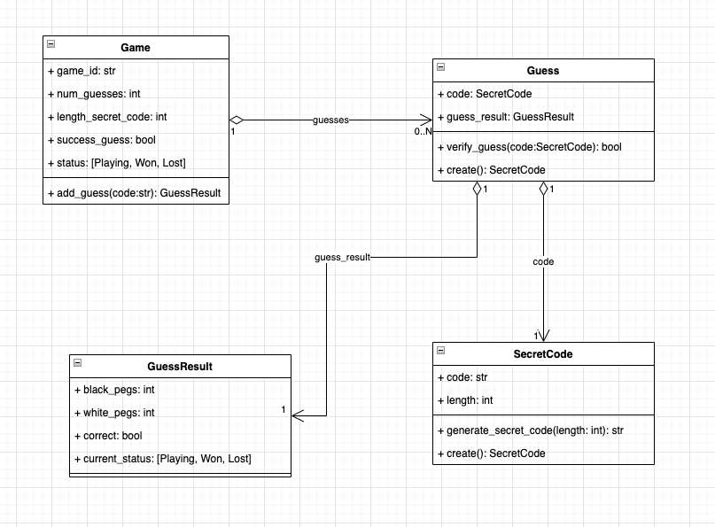

# MasterMind API

This repository contains the development of an API that allows to any client to implement this game.

It doesn't save the data in persistent mode.

### Prerequisites

Python version: 3.8

This project in order to run, needs to have installed docker on the machine.

You can install docker desktop following the instruction of [Get Docker](https://docs.docker.com/get-docker/) webpage.

### Running project

For running the project, once docker is installed correctly, the user should run the next command from the directory where this project has been unzipped/copied/...

```shell
docker-compose up --build
```

Once it runs then the user can access to the openapi documentation where it explains the two endpoints created for this test. The user only need to open the next url in any internet browser

[http://localhost:8888/openapi](http://localhost:8888/openapi)
[http://localhost:8888/redoc](http://localhost:8888/redoc)

If you want to run the app without docker then you can using the next command:

```shell
python main.py
```

### Testing

For testing this module has been used [pytest](https://docs.pytest.org/).
For testing is needed installed the requirement_dev.txt packages, which installs all packages needed by the app, and by the pytest.


### Software architecture

The app has been designed following a Domain Driven Development, and Test Driven development, alothough some more tests maybe are missing.

The design UMl of the domain is:
